# TechConf Registration Website

# RUBRIC

## Migrate Web Applications

### Create an Azure App resource in a free tier app service plan
	
Student provides a screenshot of the Azure resource showing the app service plan

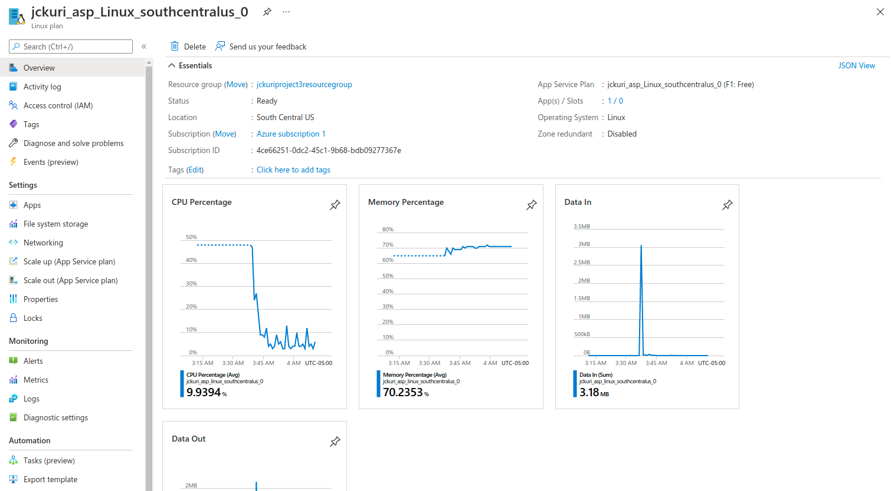

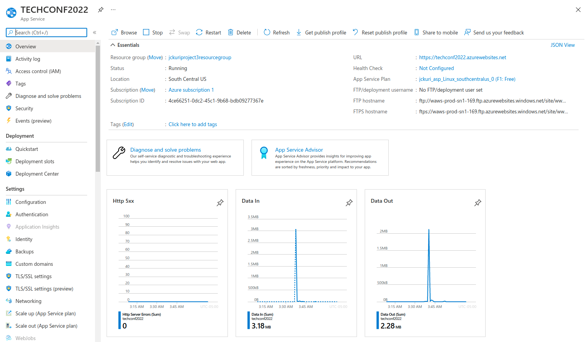

### Web App code deployed in Azure
	
Student provides a screenshot of the application successfully running with the URL in this format https://*.azurewebsites.net**. The screenshot should be fullscreen showing the URL and application running.

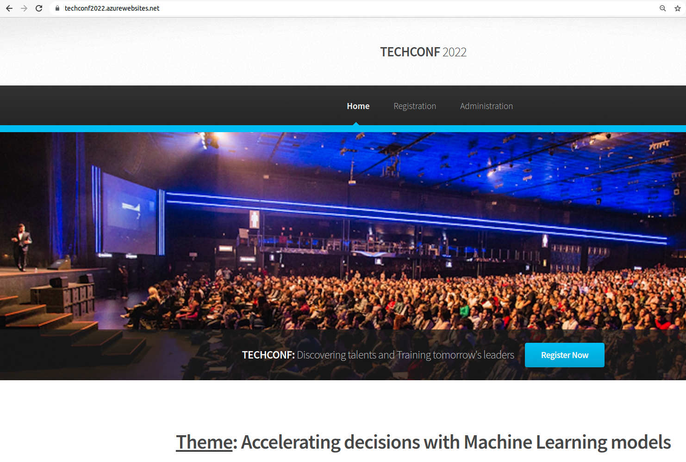

LINK:
https://techconf2022.azurewebsites.net/

## Migrate Database

### Create an Azure Postgres database in Azure
	
Student provides a screenshot of the Azure Postgres database resource created in Azure showing the database name, version, server name

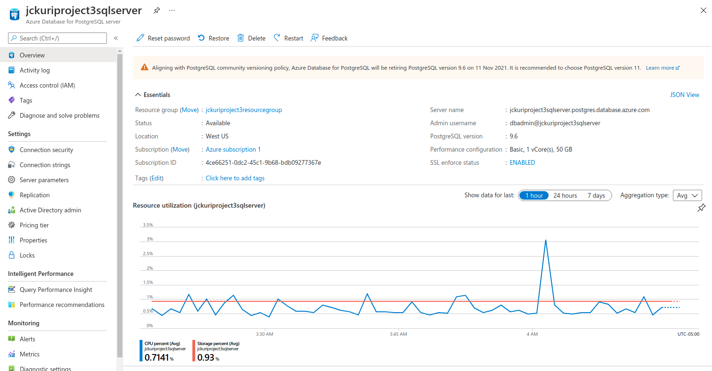

### Restore database backup to Azure Postgres database
	
Student provides a screenshot of the web app successfully loading the list of attendees and notifications from the deployed website

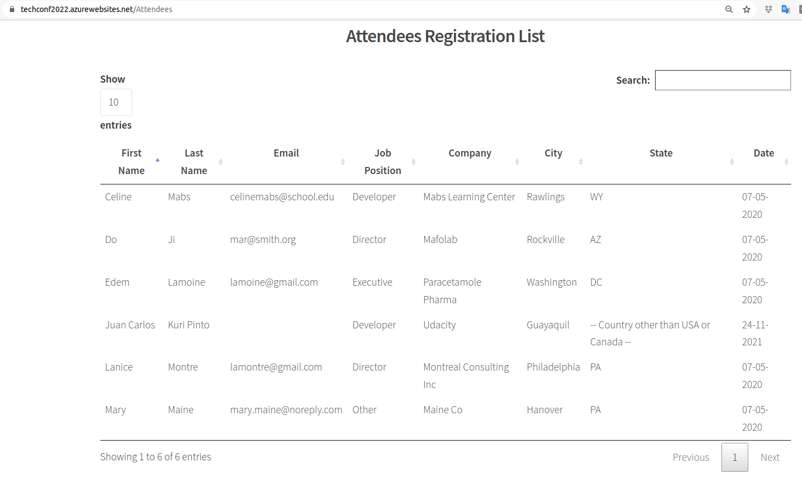

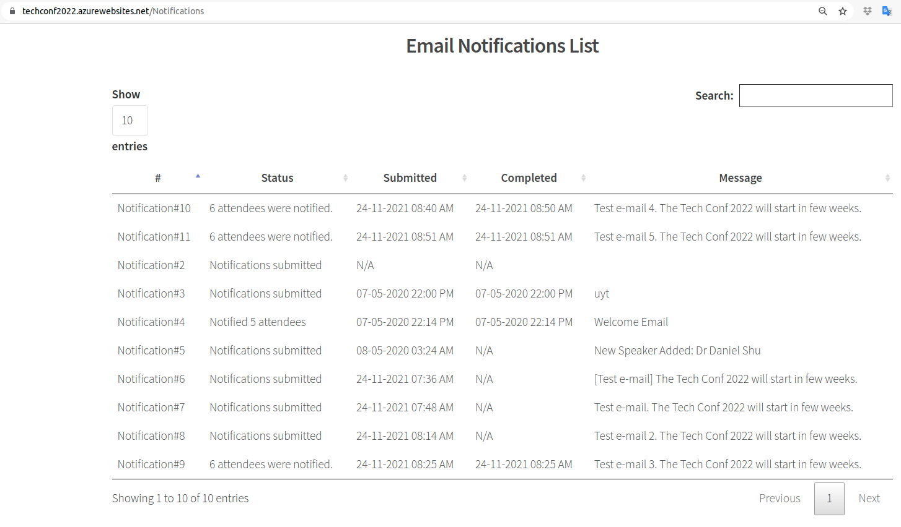

## Migrate Background Process

### Create an Azure Function resource for the migration
	
Student provides a screenshot of the Azure Function app running in Azure showing the function name and the function app plan

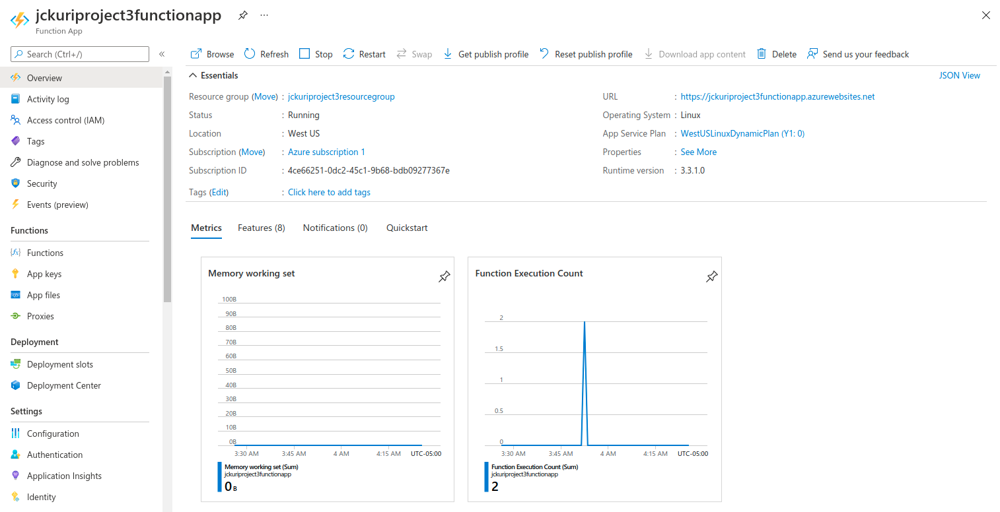

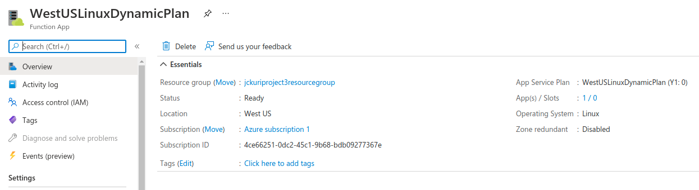

### Azure function code implemented, deployed, and triggered

Student provides screenshots of the following showing functionality of the deployed site:

1. Submitting a new notification

We send the notification:

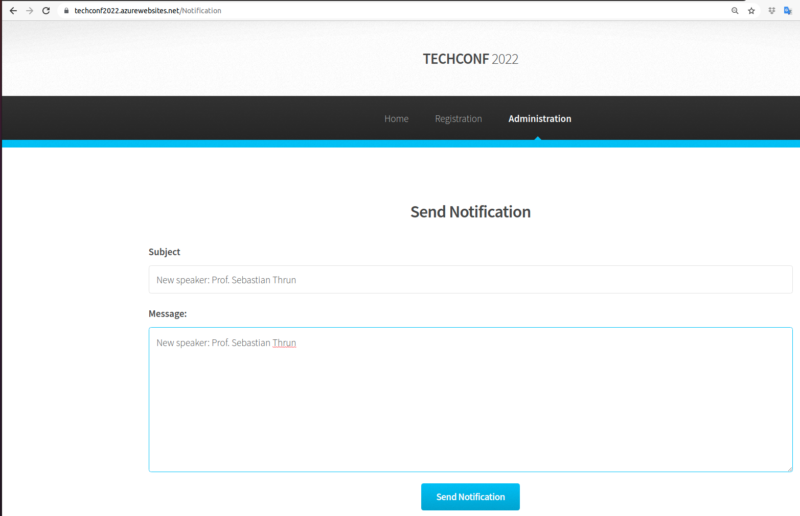

The notification is submitted. But it's not completed yet.

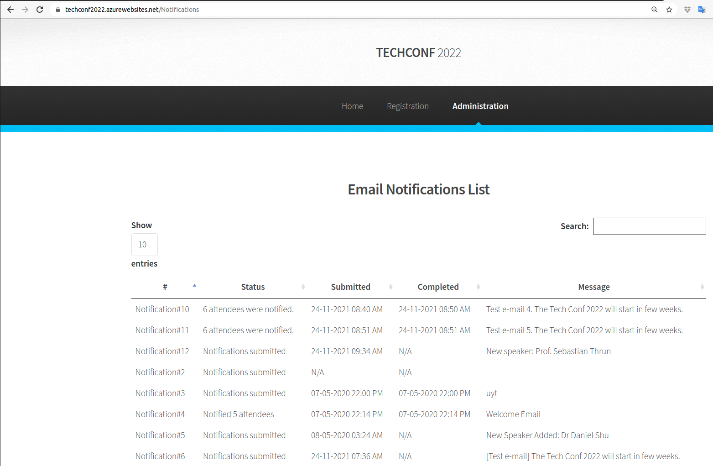

2. Notification processed after executing the Azure function

The submitted notification is completed as a asyncronous process via Service Bus:

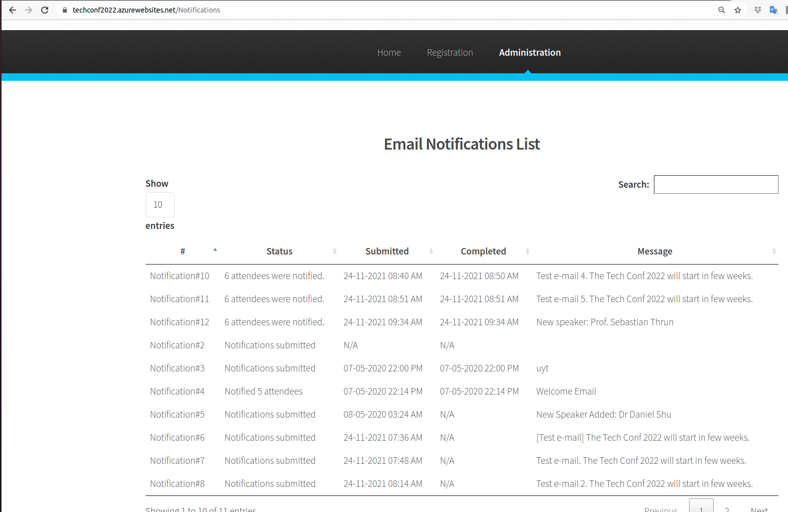

I received the notification in my e-mail account:

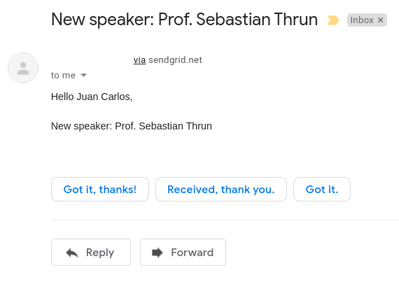

## Predicting Costs

### Cost-effective architecture for web app and function
	
Student provides a README that includes a short explanation and reasoning of the architecture selected for both the Azure web app and the Azure function in terms of cost-effectiveness

- The web app and the function app are cost-effective because these services are reasonably priced. Try running these services in on-premises and you will notice the increase in prices.
- The web app is scalable because it will scale at the presence of huge amounts of user information and peak usage in specific times, i.e. nearby the registration deadline.
- The function app to handle notifications is scalable because notifications are sent asynchronously via a Service Bus instead of doing it through synchronous method that could produce HTTP timeout exceptions when there are too many attendees to be notified.

### Predict the monthly cost of each Azure Resource

Student provides a README that includes a monthly cost analysis of the project detailing each resource’s cost

| RESOURCE TYPE                        | RESOURCE NAME             | TIER                                        | MONTHLY COST |
|--------------------------------------|---------------------------|---------------------------------------------|--------------|
| Function App                         | jckuriproject3functionapp | Consumption                                 | $0           |
| Service Bus Namespace                | jckuriproject3servicebus  | Basic                                       | $0.05        |
| Azure Database for PostgreSQL server | jckuriproject3sqlserver   | B_Gen5_1                                    | $37.77       |
| Storage account                      | jckuriproject3store       | Standard/Hot StorageV2 (general purpose v2) | $20.80       |
| App Service                          | TECHCONF2022              | F1: Free                                    | $0           |

Total monthly cost:

0 + 0.05 + 37.77 + 20.80 + 0 = $58.62

--------------------------------------------------------------------------------

# INSTRUCTIONS TO INSTALL AND TO RUN THE PROJECT

### Run database script

Execute the command `sh create_postgres_database.sh` to create the Postgres database.

The output should be something like:

```
$ sh create_postgres_database.sh 
  % Total    % Received % Xferd  Average Speed   Time    Time     Time  Current
                                 Dload  Upload   Total   Spent    Left  Speed
100    14  100    14    0     0     42      0 --:--:-- --:--:-- --:--:--    42
PREFIX: jckuriproject3
RESOURCEGROUP: jckuriproject3resourcegroup
LOCATION: westus
SQLSERVER: jckuriproject3sqlserver
DATABASE: techconfdb
CLIENT IP: 200.124.240.61
Creating resource group...
{
  "id": "/subscriptions/4ce66251-0dc2-45c1-9b68-bdb09277367e/resourceGroups/jckuriproject3resourcegroup",
  "location": "westus",
  "managedBy": null,
  "name": "jckuriproject3resourcegroup",
  "properties": {
    "provisioningState": "Succeeded"
  },
  "tags": null,
  "type": "Microsoft.Resources/resourceGroups"
}
Creating database server...
Checking the existence of the resource group 'jckuriproject3resourcegroup'...
Resource group 'jckuriproject3resourcegroup' exists ? : True 
Creating postgres Server 'jckuriproject3sqlserver' in group 'jckuriproject3resourcegroup'...
Your server 'jckuriproject3sqlserver' is using sku 'B_Gen5_1' (Paid Tier). Please refer to https://aka.ms/postgres-pricing  for pricing details
Make a note of your password. If you forget, you would have to reset your password with 'az postgres server update -n jckuriproject3sqlserver -g jckuriproject3resourcegroup -p <new-password>'.
{
  "additionalProperties": {},
  "administratorLogin": "dbadmin",
  "byokEnforcement": "Disabled",
  "connectionString": "postgres://dbadmin%40jckuriproject3sqlserver:@dm!np@ssw0rd@jckuriproject3sqlserver.postgres.database.azure.com/postgres?sslmode=require",
  "earliestRestoreDate": "2021-11-22T02:13:05.703000+00:00",
  "fullyQualifiedDomainName": "jckuriproject3sqlserver.postgres.database.azure.com",
  "id": "/subscriptions/4ce66251-0dc2-45c1-9b68-bdb09277367e/resourceGroups/jckuriproject3resourcegroup/providers/Microsoft.DBforPostgreSQL/servers/jckuriproject3sqlserver",
  "identity": null,
  "infrastructureEncryption": "Disabled",
  "location": "westus",
  "masterServerId": "",
  "minimalTlsVersion": "TLSEnforcementDisabled",
  "name": "jckuriproject3sqlserver",
  "password": "@dm!np@ssw0rd",
  "privateEndpointConnections": [],
  "publicNetworkAccess": "Enabled",
  "replicaCapacity": 5,
  "replicationRole": "None",
  "resourceGroup": "jckuriproject3resourcegroup",
  "sku": {
    "additionalProperties": {},
    "capacity": 1,
    "family": "Gen5",
    "name": "B_Gen5_1",
    "size": null,
    "tier": "Basic"
  },
  "sslEnforcement": "Enabled",
  "storageProfile": {
    "additionalProperties": {},
    "backupRetentionDays": 7,
    "geoRedundantBackup": "Disabled",
    "storageAutogrow": "Enabled",
    "storageMb": 51200
  },
  "tags": null,
  "type": "Microsoft.DBforPostgreSQL/servers",
  "userVisibleState": "Ready",
  "version": "9.6"
}
Creating firewall rule...
{
  "endIpAddress": "255.255.255.255",
  "id": "/subscriptions/4ce66251-0dc2-45c1-9b68-bdb09277367e/resourceGroups/jckuriproject3resourcegroup/providers/Microsoft.DBforPostgreSQL/servers/jckuriproject3sqlserver/firewallRules/allips",
  "name": "allips",
  "resourceGroup": "jckuriproject3resourcegroup",
  "startIpAddress": "0.0.0.0",
  "type": "Microsoft.DBforPostgreSQL/servers/firewallRules"
}
Showing database server...
{
  "administratorLogin": "dbadmin",
  "byokEnforcement": "Disabled",
  "earliestRestoreDate": "2021-11-22T02:13:05.703000+00:00",
  "fullyQualifiedDomainName": "jckuriproject3sqlserver.postgres.database.azure.com",
  "id": "/subscriptions/4ce66251-0dc2-45c1-9b68-bdb09277367e/resourceGroups/jckuriproject3resourcegroup/providers/Microsoft.DBforPostgreSQL/servers/jckuriproject3sqlserver",
  "identity": null,
  "infrastructureEncryption": "Disabled",
  "location": "westus",
  "masterServerId": "",
  "minimalTlsVersion": "TLSEnforcementDisabled",
  "name": "jckuriproject3sqlserver",
  "privateEndpointConnections": [],
  "publicNetworkAccess": "Enabled",
  "replicaCapacity": 5,
  "replicationRole": "None",
  "resourceGroup": "jckuriproject3resourcegroup",
  "sku": {
    "capacity": 1,
    "family": "Gen5",
    "name": "B_Gen5_1",
    "size": null,
    "tier": "Basic"
  },
  "sslEnforcement": "Enabled",
  "storageProfile": {
    "backupRetentionDays": 7,
    "geoRedundantBackup": "Disabled",
    "storageAutogrow": "Enabled",
    "storageMb": 51200
  },
  "tags": null,
  "type": "Microsoft.DBforPostgreSQL/servers",
  "userVisibleState": "Ready",
  "version": "9.6"
}
Creating database...
{
  "charset": "UTF8",
  "collation": "English_United States.1252",
  "id": "/subscriptions/4ce66251-0dc2-45c1-9b68-bdb09277367e/resourceGroups/jckuriproject3resourcegroup/providers/Microsoft.DBforPostgreSQL/servers/jckuriproject3sqlserver/databases/techconfdb",
  "name": "techconfdb",
  "resourceGroup": "jckuriproject3resourcegroup",
  "type": "Microsoft.DBforPostgreSQL/servers/databases"
}

```

### Restore the database

Go to the PG Admin page and log in with your credentials:

http://127.0.0.1/pgadmin4/browser/

Create a new server. Right click on `Servers`. Select `Create`. Click on `Server...`.
Enter the server name, the host address, the user name, and the password of the database connection.


Right click on `techconfdb`. Click on `Restore...`. Select the file `techconfdb_backup.tar`.
And restore the database.

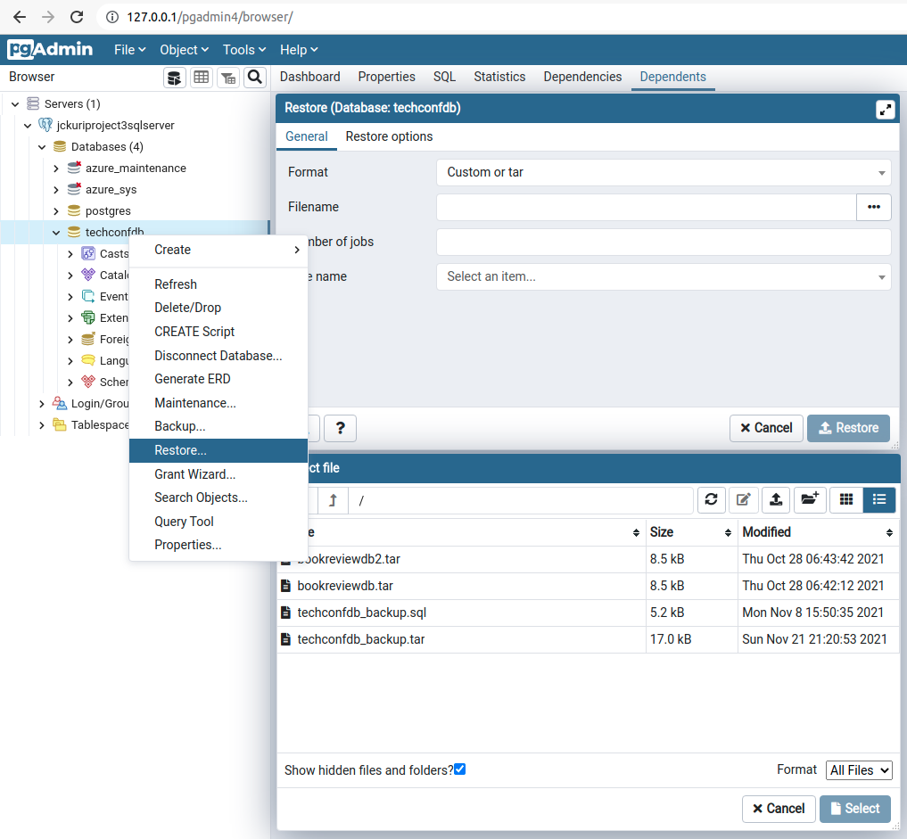

Right click on `techconfdb`. Click on `Query Tool`.
Type the following script to modify some fields on the database and push the `Play` button to run the script.

```
CREATE SEQUENCE attendee_id START 6 OWNED BY attendee.id;
ALTER TABLE attendee ALTER COLUMN id SET DEFAULT nextval('attendee_id');
CREATE SEQUENCE notification_id START 6 OWNED BY notification.id;
ALTER TABLE notification ALTER COLUMN id SET DEFAULT nextval('notification_id');
```

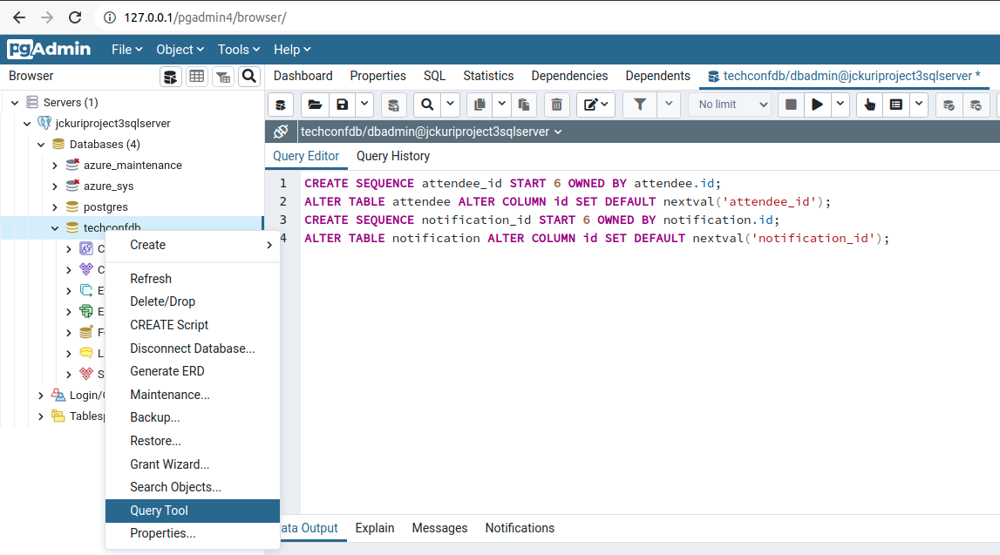

### Initialize the Azure Function

Run the following commands in order to initialize the Azure Function and to write the template code:

```
pipenv shell
pipenv install
func init function --python
cd function
func new --name QueueTrigger --template "Azure Service Bus Queue trigger" --language python
```

Modify the QueueTrigger to send the notifications to attendees in an asynchronous way:
[function/QueueTrigger/__init__.py](function/QueueTrigger/__init__.py)

Modify the TODO section of this file:
[web/app/routes.py](web/app/routes.py)

### Create Function App

Run the following command `sh create_function_app.sh` in order to create the Function App.
The result should be something like this:

```
$ sh create_function_app.sh 
PREFIX: jckuriproject3
RESOURCEGROUP: jckuriproject3resourcegroup
LOCATION: westus
STORAGEACCOUNT: jckuriproject3store
FUNCTIONAPP: jckuriproject3functionapp
{
  "accessTier": "Hot",
  "allowBlobPublicAccess": true,
  "allowCrossTenantReplication": null,
  "allowSharedKeyAccess": null,
  "azureFilesIdentityBasedAuthentication": null,
  "blobRestoreStatus": null,
  "creationTime": "2021-11-24T02:39:30.823647+00:00",
  "customDomain": null,
  "defaultToOAuthAuthentication": null,
  "enableHttpsTrafficOnly": true,
  "enableNfsV3": null,
  "encryption": {
    "encryptionIdentity": null,
    "keySource": "Microsoft.Storage",
    "keyVaultProperties": null,
    "requireInfrastructureEncryption": null,
    "services": {
      "blob": {
        "enabled": true,
        "keyType": "Account",
        "lastEnabledTime": "2021-11-24T02:39:30.917414+00:00"
      },
      "file": {
        "enabled": true,
        "keyType": "Account",
        "lastEnabledTime": "2021-11-24T02:39:30.917414+00:00"
      },
      "queue": null,
      "table": null
    }
  },
  "extendedLocation": null,
  "failoverInProgress": null,
  "geoReplicationStats": null,
  "id": "/subscriptions/4ce66251-0dc2-45c1-9b68-bdb09277367e/resourceGroups/jckuriproject3resourcegroup/providers/Microsoft.Storage/storageAccounts/jckuriproject3store",
  "identity": null,
  "immutableStorageWithVersioning": null,
  "isHnsEnabled": null,
  "keyCreationTime": {
    "key1": "2021-11-24T02:39:30.917414+00:00",
    "key2": "2021-11-24T02:39:30.917414+00:00"
  },
  "keyPolicy": null,
  "kind": "StorageV2",
  "largeFileSharesState": null,
  "lastGeoFailoverTime": null,
  "location": "westus",
  "minimumTlsVersion": "TLS1_0",
  "name": "jckuriproject3store",
  "networkRuleSet": {
    "bypass": "AzureServices",
    "defaultAction": "Allow",
    "ipRules": [],
    "resourceAccessRules": null,
    "virtualNetworkRules": []
  },
  "primaryEndpoints": {
    "blob": "https://jckuriproject3store.blob.core.windows.net/",
    "dfs": "https://jckuriproject3store.dfs.core.windows.net/",
    "file": "https://jckuriproject3store.file.core.windows.net/",
    "internetEndpoints": null,
    "microsoftEndpoints": null,
    "queue": "https://jckuriproject3store.queue.core.windows.net/",
    "table": "https://jckuriproject3store.table.core.windows.net/",
    "web": "https://jckuriproject3store.z22.web.core.windows.net/"
  },
  "primaryLocation": "westus",
  "privateEndpointConnections": [],
  "provisioningState": "Succeeded",
  "publicNetworkAccess": null,
  "resourceGroup": "jckuriproject3resourcegroup",
  "routingPreference": null,
  "sasPolicy": null,
  "secondaryEndpoints": {
    "blob": "https://jckuriproject3store-secondary.blob.core.windows.net/",
    "dfs": "https://jckuriproject3store-secondary.dfs.core.windows.net/",
    "file": null,
    "internetEndpoints": null,
    "microsoftEndpoints": null,
    "queue": "https://jckuriproject3store-secondary.queue.core.windows.net/",
    "table": "https://jckuriproject3store-secondary.table.core.windows.net/",
    "web": "https://jckuriproject3store-secondary.z22.web.core.windows.net/"
  },
  "secondaryLocation": "eastus",
  "sku": {
    "name": "Standard_RAGRS",
    "tier": "Standard"
  },
  "statusOfPrimary": "available",
  "statusOfSecondary": "available",
  "tags": {},
  "type": "Microsoft.Storage/storageAccounts"
}
No functions version specified so defaulting to 2. In the future, specifying a version will be required. To create a 2.x function you would pass in the flag `--functions-version 2`
Your Linux function app 'jckuriproject3functionapp', that uses a consumption plan has been successfully created but is not active until content is published using Azure Portal or the Functions Core Tools.
Application Insights "jckuriproject3functionapp" was created for this Function App. You can visit https://portal.azure.com/#resource/subscriptions/4ce66251-0dc2-45c1-9b68-bdb09277367e/resourceGroups/jckuriproject3resourcegroup/providers/microsoft.insights/components/jckuriproject3functionapp/overview to view your Application Insights component
{
  "availabilityState": "Normal",
  "clientAffinityEnabled": false,
  "clientCertEnabled": false,
  "clientCertExclusionPaths": null,
  "clientCertMode": "Required",
  "cloningInfo": null,
  "containerSize": 0,
  "customDomainVerificationId": "72BAEDF6151DB46B3CE9B092968630DB957E6D4719E4CBA98BA78282E0544C99",
  "dailyMemoryTimeQuota": 0,
  "defaultHostName": "jckuriproject3functionapp.azurewebsites.net",
  "enabled": true,
  "enabledHostNames": [
    "jckuriproject3functionapp.azurewebsites.net",
    "jckuriproject3functionapp.scm.azurewebsites.net"
  ],
  "hostNameSslStates": [
    {
      "hostType": "Standard",
      "ipBasedSslResult": null,
      "ipBasedSslState": "NotConfigured",
      "name": "jckuriproject3functionapp.azurewebsites.net",
      "sslState": "Disabled",
      "thumbprint": null,
      "toUpdate": null,
      "toUpdateIpBasedSsl": null,
      "virtualIp": null
    },
    {
      "hostType": "Repository",
      "ipBasedSslResult": null,
      "ipBasedSslState": "NotConfigured",
      "name": "jckuriproject3functionapp.scm.azurewebsites.net",
      "sslState": "Disabled",
      "thumbprint": null,
      "toUpdate": null,
      "toUpdateIpBasedSsl": null,
      "virtualIp": null
    }
  ],
  "hostNames": [
    "jckuriproject3functionapp.azurewebsites.net"
  ],
  "hostNamesDisabled": false,
  "hostingEnvironmentProfile": null,
  "httpsOnly": false,
  "hyperV": false,
  "id": "/subscriptions/4ce66251-0dc2-45c1-9b68-bdb09277367e/resourceGroups/jckuriproject3resourcegroup/providers/Microsoft.Web/sites/jckuriproject3functionapp",
  "identity": null,
  "inProgressOperationId": null,
  "isDefaultContainer": null,
  "isXenon": false,
  "kind": "functionapp,linux",
  "lastModifiedTimeUtc": "2021-11-24T02:40:00.523333",
  "location": "westus",
  "maxNumberOfWorkers": null,
  "name": "jckuriproject3functionapp",
  "outboundIpAddresses": "13.93.220.109,13.93.205.56,52.160.105.227,104.209.45.67,13.91.108.234",
  "possibleOutboundIpAddresses": "13.93.220.109,13.93.205.56,52.160.105.227,104.209.45.67,13.91.108.234,13.93.235.174,52.160.85.43",
  "redundancyMode": "None",
  "repositorySiteName": "jckuriproject3functionapp",
  "reserved": true,
  "resourceGroup": "jckuriproject3resourcegroup",
  "scmSiteAlsoStopped": false,
  "serverFarmId": "/subscriptions/4ce66251-0dc2-45c1-9b68-bdb09277367e/resourceGroups/jckuriproject3resourcegroup/providers/Microsoft.Web/serverfarms/WestUSLinuxDynamicPlan",
  "siteConfig": {
    "acrUseManagedIdentityCreds": false,
    "acrUserManagedIdentityId": null,
    "alwaysOn": false,
    "apiDefinition": null,
    "apiManagementConfig": null,
    "appCommandLine": null,
    "appSettings": null,
    "autoHealEnabled": null,
    "autoHealRules": null,
    "autoSwapSlotName": null,
    "azureMonitorLogCategories": null,
    "azureStorageAccounts": null,
    "connectionStrings": null,
    "cors": null,
    "customAppPoolIdentityAdminState": null,
    "customAppPoolIdentityTenantState": null,
    "defaultDocuments": null,
    "detailedErrorLoggingEnabled": null,
    "documentRoot": null,
    "experiments": null,
    "fileChangeAuditEnabled": null,
    "ftpsState": null,
    "functionAppScaleLimit": 0,
    "functionsRuntimeScaleMonitoringEnabled": null,
    "handlerMappings": null,
    "healthCheckPath": null,
    "http20Enabled": false,
    "httpLoggingEnabled": null,
    "ipSecurityRestrictions": [
      {
        "action": "Allow",
        "description": "Allow all access",
        "headers": null,
        "ipAddress": "Any",
        "name": "Allow all",
        "priority": 1,
        "subnetMask": null,
        "subnetTrafficTag": null,
        "tag": null,
        "vnetSubnetResourceId": null,
        "vnetTrafficTag": null
      }
    ],
    "javaContainer": null,
    "javaContainerVersion": null,
    "javaVersion": null,
    "keyVaultReferenceIdentity": null,
    "limits": null,
    "linuxFxVersion": "",
    "loadBalancing": null,
    "localMySqlEnabled": null,
    "logsDirectorySizeLimit": null,
    "machineKey": null,
    "managedPipelineMode": null,
    "managedServiceIdentityId": null,
    "metadata": null,
    "minTlsVersion": null,
    "minimumElasticInstanceCount": 0,
    "netFrameworkVersion": null,
    "nodeVersion": null,
    "numberOfWorkers": 1,
    "phpVersion": null,
    "powerShellVersion": null,
    "preWarmedInstanceCount": null,
    "publicNetworkAccess": null,
    "publishingPassword": null,
    "publishingUsername": null,
    "push": null,
    "pythonVersion": null,
    "remoteDebuggingEnabled": null,
    "remoteDebuggingVersion": null,
    "requestTracingEnabled": null,
    "requestTracingExpirationTime": null,
    "routingRules": null,
    "runtimeADUser": null,
    "runtimeADUserPassword": null,
    "scmIpSecurityRestrictions": [
      {
        "action": "Allow",
        "description": "Allow all access",
        "headers": null,
        "ipAddress": "Any",
        "name": "Allow all",
        "priority": 1,
        "subnetMask": null,
        "subnetTrafficTag": null,
        "tag": null,
        "vnetSubnetResourceId": null,
        "vnetTrafficTag": null
      }
    ],
    "scmIpSecurityRestrictionsUseMain": null,
    "scmMinTlsVersion": null,
    "scmType": null,
    "sitePort": null,
    "tracingOptions": null,
    "use32BitWorkerProcess": null,
    "virtualApplications": null,
    "vnetName": null,
    "vnetPrivatePortsCount": null,
    "vnetRouteAllEnabled": null,
    "webSocketsEnabled": null,
    "websiteTimeZone": null,
    "winAuthAdminState": null,
    "winAuthTenantState": null,
    "windowsFxVersion": null,
    "xManagedServiceIdentityId": null
  },
  "slotSwapStatus": null,
  "state": "Running",
  "suspendedTill": null,
  "systemData": null,
  "tags": null,
  "targetSwapSlot": null,
  "trafficManagerHostNames": null,
  "type": "Microsoft.Web/sites",
  "usageState": "Normal"
}
```

### Create Service Bus

Run the following command `sh create_service_bus.sh` in order to create the Service Bus.
The result should be something like this:

```
$ sh create_service_bus.sh 
PREFIX: jckuriproject3
RESOURCEGROUP: jckuriproject3resourcegroup
LOCATION: westus
SERVICEBUS: jckuriproject3servicebus
QUEUE: jckuriproject3queue
CREATING SERVICE BUS...
{
  "createdAt": "2021-11-24T02:48:24.633000+00:00",
  "encryption": null,
  "id": "/subscriptions/4ce66251-0dc2-45c1-9b68-bdb09277367e/resourceGroups/jckuriproject3resourcegroup/providers/Microsoft.ServiceBus/namespaces/jckuriproject3servicebus",
  "identity": null,
  "location": "West US",
  "metricId": "4ce66251-0dc2-45c1-9b68-bdb09277367e:jckuriproject3servicebus",
  "name": "jckuriproject3servicebus",
  "provisioningState": "Succeeded",
  "resourceGroup": "jckuriproject3resourcegroup",
  "serviceBusEndpoint": "https://jckuriproject3servicebus.servicebus.windows.net:443/",
  "sku": {
    "capacity": null,
    "name": "Basic",
    "tier": "Basic"
  },
  "tags": {},
  "type": "Microsoft.ServiceBus/Namespaces",
  "updatedAt": "2021-11-24T02:49:08.730000+00:00",
  "zoneRedundant": false
}
CREATING QUEUE...
{
  "accessedAt": "0001-01-01T00:00:00",
  "autoDeleteOnIdle": "10675199 days, 2:48:05.477581",
  "countDetails": {
    "activeMessageCount": 0,
    "deadLetterMessageCount": 0,
    "scheduledMessageCount": 0,
    "transferDeadLetterMessageCount": 0,
    "transferMessageCount": 0
  },
  "createdAt": "2021-11-24T02:49:29.043000+00:00",
  "deadLetteringOnMessageExpiration": false,
  "defaultMessageTimeToLive": "14 days, 0:00:00",
  "duplicateDetectionHistoryTimeWindow": "0:10:00",
  "enableBatchedOperations": true,
  "enableExpress": false,
  "enablePartitioning": true,
  "forwardDeadLetteredMessagesTo": null,
  "forwardTo": null,
  "id": "/subscriptions/4ce66251-0dc2-45c1-9b68-bdb09277367e/resourceGroups/jckuriproject3resourcegroup/providers/Microsoft.ServiceBus/namespaces/jckuriproject3servicebus/queues/jckuriproject3queue",
  "location": "West US",
  "lockDuration": "0:01:00",
  "maxDeliveryCount": 10,
  "maxSizeInMegabytes": 16384,
  "messageCount": 0,
  "name": "jckuriproject3queue",
  "requiresDuplicateDetection": false,
  "requiresSession": false,
  "resourceGroup": "jckuriproject3resourcegroup",
  "sizeInBytes": 0,
  "status": "Active",
  "type": "Microsoft.ServiceBus/Namespaces/Queues",
  "updatedAt": "2021-11-24T02:49:29.223000+00:00"
}
GETTING CONNECTION STRING...
CONNECTION STRING:
Endpoint=sb://jckuriproject3servicebus.servicebus.windows.net/;SharedAccessKeyName=RootManageSharedAccessKey;SharedAccessKey=FpSyBA3JLPz8R/zeYubqpZHRjZMRDYBa5VhUhE5kNNo=
```

### Update Attributes

Update the attributes `AzureWebJobsStorage`, `AzureWebJobsServiceBus` and `SENDGRID_API_KEY` in the file `local.settings.json` and in the Function App configuration in the Azure portal.


This step is important to deploy the Function App in Azure in a correct way, without producing errors.

Update the attributes `queueName` and `connection` in the file `function.json`.

Update the file [web/config.py](web/config.py) and complete all the TODOs.

### Locally test the Function App and the Web App

Open 2 new terminals and run these 2 sets of commands in order to locally test the Function App and to locally test the Web App:

```
pipenv shell
pipenv install
cd function
func start --verbose
```

```
pipenv shell
pipenv install
cd web
python application.py
```

### Deploy the Function App and the Web App to Azure

By using the 2 previous terminals, run these 2 sets of commands in order to deploy in Azure the Function App and the WebApp:

```
pipenv shell
pipenv install
cd function
func azure functionapp publish jckuriproject3functionapp
```

```
pipenv shell
pipenv install
cd web
az webapp up --resource-group jckuriproject3resourcegroup --name TECHCONF2022 --sku F1 
```

### Test the Web App

Go to the website: https://techconf2022.azurewebsites.net/

Use the functions registration and send notification.
