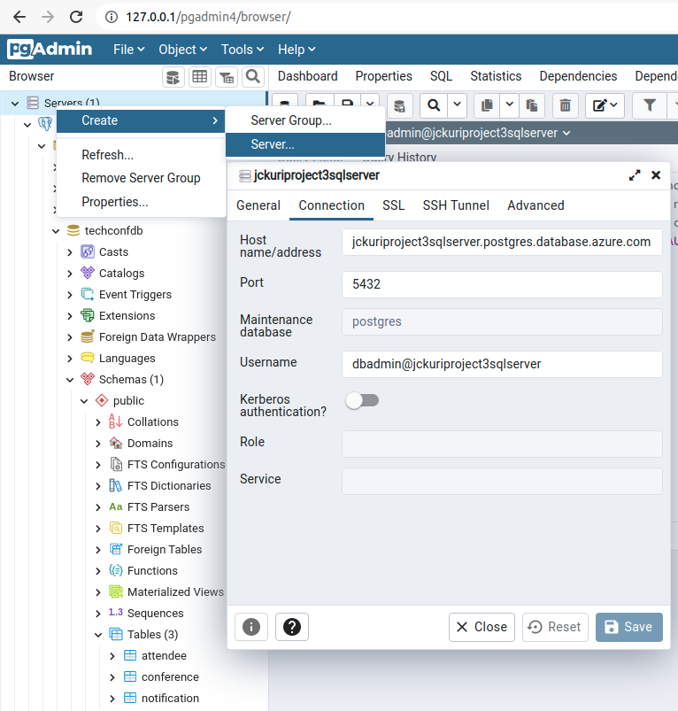

# TechConf Registration Website

# RUBRIC

## Migrate Web Applications

### Create an Azure App resource in a free tier app service plan
	
Student provides a screenshot of the Azure resource showing the app service plan

### Web App code deployed in Azure
	
Student provides a screenshot of the application successfully running with the URL in this format https://*.azurewebsites.net**. The screenshot should be fullscreen showing the URL and application running.

## Migrate Database

### Create an Azure Postgres database in Azure
	
Student provides a screenshot of the Azure Postgres database resource created in Azure showing the database name, version, server name

### Restore database backup to Azure Postgres database
	
Student provides a screenshot of the web app successfully loading the list of attendees and notifications from the deployed website

## Migrate Background Process

### Create an Azure Function resource for the migration
	
Student provides a screenshot of the Azure Function app running in Azure showing the function name and the function app plan

### Azure function code implemented, deployed, and triggered

Student provides screenshots of the following showing functionality of the deployed site:

1. Submitting a new notification
2. Notification processed after executing the Azure function

## Predicting Costs

### Cost-effective architecture for web app and function
	
Student provides a README that includes a short explanation and reasoning of the architecture selected for both the Azure web app and the Azure function in terms of cost-effectiveness

### Predict the monthly cost of each Azure Resource

Student provides a README that includes a monthly cost analysis of the project detailing each resource’s cost

--------------------------------------------------------------------------------

# INSTRUCTIONS TO INSTALL AND TO RUN THE PROJECT

### Run database script

Execute the command `sh create_postgres_database.sh` to create the Postgres database.

The output should be something like:

```
$ sh create_postgres_database.sh 
  % Total    % Received % Xferd  Average Speed   Time    Time     Time  Current
                                 Dload  Upload   Total   Spent    Left  Speed
100    14  100    14    0     0     42      0 --:--:-- --:--:-- --:--:--    42
PREFIX: jckuriproject3
RESOURCEGROUP: jckuriproject3resourcegroup
LOCATION: westus
SQLSERVER: jckuriproject3sqlserver
DATABASE: techconfdb
CLIENT IP: 200.124.240.61
Creating resource group...
{
  "id": "/subscriptions/4ce66251-0dc2-45c1-9b68-bdb09277367e/resourceGroups/jckuriproject3resourcegroup",
  "location": "westus",
  "managedBy": null,
  "name": "jckuriproject3resourcegroup",
  "properties": {
    "provisioningState": "Succeeded"
  },
  "tags": null,
  "type": "Microsoft.Resources/resourceGroups"
}
Creating database server...
Checking the existence of the resource group 'jckuriproject3resourcegroup'...
Resource group 'jckuriproject3resourcegroup' exists ? : True 
Creating postgres Server 'jckuriproject3sqlserver' in group 'jckuriproject3resourcegroup'...
Your server 'jckuriproject3sqlserver' is using sku 'B_Gen5_1' (Paid Tier). Please refer to https://aka.ms/postgres-pricing  for pricing details
Make a note of your password. If you forget, you would have to reset your password with 'az postgres server update -n jckuriproject3sqlserver -g jckuriproject3resourcegroup -p <new-password>'.
{
  "additionalProperties": {},
  "administratorLogin": "dbadmin",
  "byokEnforcement": "Disabled",
  "connectionString": "postgres://dbadmin%40jckuriproject3sqlserver:@dm!np@ssw0rd@jckuriproject3sqlserver.postgres.database.azure.com/postgres?sslmode=require",
  "earliestRestoreDate": "2021-11-22T02:13:05.703000+00:00",
  "fullyQualifiedDomainName": "jckuriproject3sqlserver.postgres.database.azure.com",
  "id": "/subscriptions/4ce66251-0dc2-45c1-9b68-bdb09277367e/resourceGroups/jckuriproject3resourcegroup/providers/Microsoft.DBforPostgreSQL/servers/jckuriproject3sqlserver",
  "identity": null,
  "infrastructureEncryption": "Disabled",
  "location": "westus",
  "masterServerId": "",
  "minimalTlsVersion": "TLSEnforcementDisabled",
  "name": "jckuriproject3sqlserver",
  "password": "@dm!np@ssw0rd",
  "privateEndpointConnections": [],
  "publicNetworkAccess": "Enabled",
  "replicaCapacity": 5,
  "replicationRole": "None",
  "resourceGroup": "jckuriproject3resourcegroup",
  "sku": {
    "additionalProperties": {},
    "capacity": 1,
    "family": "Gen5",
    "name": "B_Gen5_1",
    "size": null,
    "tier": "Basic"
  },
  "sslEnforcement": "Enabled",
  "storageProfile": {
    "additionalProperties": {},
    "backupRetentionDays": 7,
    "geoRedundantBackup": "Disabled",
    "storageAutogrow": "Enabled",
    "storageMb": 51200
  },
  "tags": null,
  "type": "Microsoft.DBforPostgreSQL/servers",
  "userVisibleState": "Ready",
  "version": "9.6"
}
Creating firewall rule...
{
  "endIpAddress": "255.255.255.255",
  "id": "/subscriptions/4ce66251-0dc2-45c1-9b68-bdb09277367e/resourceGroups/jckuriproject3resourcegroup/providers/Microsoft.DBforPostgreSQL/servers/jckuriproject3sqlserver/firewallRules/allips",
  "name": "allips",
  "resourceGroup": "jckuriproject3resourcegroup",
  "startIpAddress": "0.0.0.0",
  "type": "Microsoft.DBforPostgreSQL/servers/firewallRules"
}
Showing database server...
{
  "administratorLogin": "dbadmin",
  "byokEnforcement": "Disabled",
  "earliestRestoreDate": "2021-11-22T02:13:05.703000+00:00",
  "fullyQualifiedDomainName": "jckuriproject3sqlserver.postgres.database.azure.com",
  "id": "/subscriptions/4ce66251-0dc2-45c1-9b68-bdb09277367e/resourceGroups/jckuriproject3resourcegroup/providers/Microsoft.DBforPostgreSQL/servers/jckuriproject3sqlserver",
  "identity": null,
  "infrastructureEncryption": "Disabled",
  "location": "westus",
  "masterServerId": "",
  "minimalTlsVersion": "TLSEnforcementDisabled",
  "name": "jckuriproject3sqlserver",
  "privateEndpointConnections": [],
  "publicNetworkAccess": "Enabled",
  "replicaCapacity": 5,
  "replicationRole": "None",
  "resourceGroup": "jckuriproject3resourcegroup",
  "sku": {
    "capacity": 1,
    "family": "Gen5",
    "name": "B_Gen5_1",
    "size": null,
    "tier": "Basic"
  },
  "sslEnforcement": "Enabled",
  "storageProfile": {
    "backupRetentionDays": 7,
    "geoRedundantBackup": "Disabled",
    "storageAutogrow": "Enabled",
    "storageMb": 51200
  },
  "tags": null,
  "type": "Microsoft.DBforPostgreSQL/servers",
  "userVisibleState": "Ready",
  "version": "9.6"
}
Creating database...
{
  "charset": "UTF8",
  "collation": "English_United States.1252",
  "id": "/subscriptions/4ce66251-0dc2-45c1-9b68-bdb09277367e/resourceGroups/jckuriproject3resourcegroup/providers/Microsoft.DBforPostgreSQL/servers/jckuriproject3sqlserver/databases/techconfdb",
  "name": "techconfdb",
  "resourceGroup": "jckuriproject3resourcegroup",
  "type": "Microsoft.DBforPostgreSQL/servers/databases"
}

```

### Restore the database


